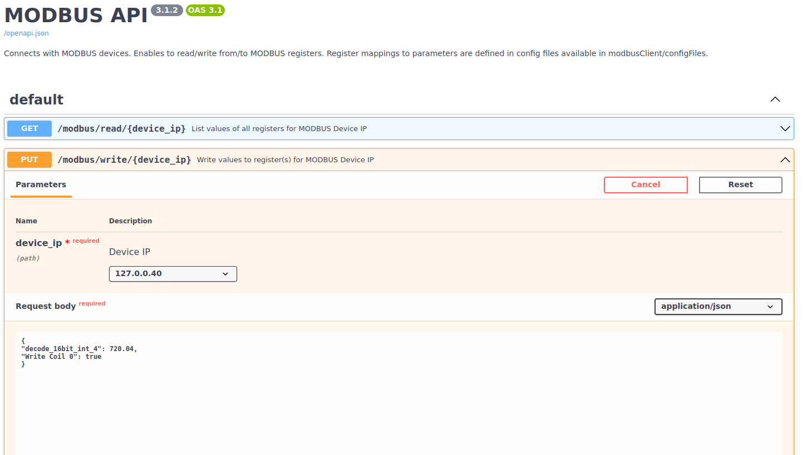

# A Universal MODBUS Client

## The READER

A universal MODBUS interface, where the mapping of variables to coil,
discrete input, input registers, and holding registers is entirely defined
by a JSON file (see below), 
with no modification to the coding required whatsoever. The JSON file
comprises keys pointing to single or multiple registers. Each dictionary key 
comprises additional features, such as 

1) "parameter" (mandatory, variable name unique over all register classes). 
2) "function" (mandatory, data type for input and holding registers).
3) "description" (optional).
4) "map" (optional). 
5) "muliplier" (optional, solely for input and holding registers of datatype integer).
6) "offset" (optional, solely for input and holding registers of datatype integer).

The latter two, when provided, will not be passed on to the output, though.
They are parsed, such that the register's value is multiplied by "multiplier" 
and "offset" is added. This is in most instances applicable for integer of lengths
8 and 16 bits. 

A map is provided in case a value needs to match 
an entry from a provided list. The corresponding field value is passed on to 
the output as description superseding the input "description". A map might also 
contain entries matching bits of the leading or trailing byte.
If a map is defined, the description is chosen according to round(value). 

Furthermore, "value" and "datatype" are
reserved keywords, since they will be generated in the output dictionary.
Additional nested dictionary key/value pairs may be provided in the client registry
mapping, which are merely passed on to the output. To maintain consistancy over
the various modbus clients, we urge selecting same features for further
optional keys, such as "defaultvalue", "unit", "min", or "max".

Register keys are in the following formates: 
e.g. "30011" addressing the 12th register
of the input register class, "30011/1" or "30011/2" for
the leading and trailing byte of the 16 bit register, respectively.
Furthermore, "30011/30012" or "30011/30014" address the 32 or 64 bit 
broad registers starting at the 12th register.
A function needs to be defined for input and holding registers that translates
the 8, 16, 32, or 64 bits into appropriate values. This function is in the form,
e.g. "decode_32bit_uint" (see below for a selection):

| Function                                     | Value              | Avro Data Type |
|----------------------------------------------|--------------------|----------------|
| 8 bits of 1<sup>st</sup>/2<sup>nd</sup> byte | decode_bits        | boolean        |
| string of variable length                    | decode_string      | string         | 
| 8 int of 1<sup>st</sup>/2<sup>nd</sup> byte  | decode_8bit_int    | int            |
| 8 uint of 1<sup>st</sup>/2<sup>nd</sup> byte | decode_8bit_uint   | int            |
| 16 int                                       | decode_16bit_int   | int            |
| 16 uint                                      | decode_16bit_uint  | int            |
| 32 int                                       | decode_32bit_int   | int            |
| 32 uint                                      | decode_32bit_uint  | int            |
| 16 float                                     | decode_16bit_float | float          |
| 32 float                                     | decode_32bit_float | float          |
| 64 int                                       | decode_64bit_int   | long           |
| 64 uint                                      | decode_64bit_uint  | long           | 
| 64 float                                     | decode_64bit_float | double         |

Gaps between registers are permitted. A check on the uniqueness of "parameter" is 
performed as well as validity checks on the JSON keys. 
Not checked is if, e.g. an odd number of registers
is allocated for float or int, though.

The JSON format for the mapping + config 
is to be defined in the following formate, e.g.:

```JSON
{
  "server": {
    "listenerAddress": "127.0.0.40",
    "listenerPort": 5020
  },
  "endianness": {
    "byteorder": ">",
    "wordorder": ">"
  },
  "debug": true,
  "mapping": {
    "10000": {
      "parameter": "UnitOn",
      "description": "Unit On status: TRUE = Unit ON"
    },
    "10001": {
      "parameter": "Unit_Alarm"
    },
    "30001": {
      "function": "decode_16bit_uint",
      "parameter": "Operating State",
      "map": {
        "0": "Idling ‐ ready to start",
        "2": "Starting",
        "3": "Running",
        "5": "Stopping",
        "6": "Error Lockout",
        "7": "Error",
        "8": "Helium Cool Down",
        "9": "Power related Error",
        "15": "Recovered from Error"
      }
    },
    "30002": {
      "function": "decode_16bit_uint",
      "parameter": "Compressor Running",
      "map": {
        "0": "Off",
        "1": "On"
      }
    },
    "30003/30004": {
      "function": "decode_32bit_float",
      "parameter": "Warning State",
      "map": {
        "0": "No warnings",
        "-1": "Coolant IN running High",
        "-2": "Coolant IN running Low",
        "-4": "Coolant OUT running High",
        "-8": "Coolant OUT running Low",
        "-16": "Oil running High",
        "-32": "Oil running Low",
        "-64": "Helium running High",
        "-128": "Helium running Low",
        "-256": "Low Pressure running High",
        "-512": "Low Pressure running Low",
        "-1024": "High Pressure running High",
        "-2048": "High Pressure running Low",
        "-4096": "Delta Pressure running High",
        "-8192": "Delta Pressure running Low",
        "-131072": "Static Pressure running High",
        "-262144": "Static Pressure running Low",
        "-524288": "Cold head motor Stall"
      }
    },
    "30011/30012": {
      "function": "decode_32bit_float",
      "parameter": "Oil Temp",
      "description": "unit is provided here...",
      "unit": "e.g. Fahrenheit"
    },
    "30031": {
      "function": "decode_16bit_uint",
      "parameter": "Panel Serial Number",
      "description": "This is supposed to be the Panel Serial Number"
    },
    "30033": {
      "function": "decode_16bit_uint",
      "parameter": "Software Rev"
    },
    "30034/1": {
      "function": "decode_bits",
      "parameter": "TEST1",
      "default": "test7",
      "map": {
        "0b10000000": "test7"
      }
    },
    "30034/2": {
      "function": "decode_bits",
      "parameter": "TEST2",
      "map": {
        "0b00000001": "test0",
        "0b00000010": "test1",
        "0b00000100": "test2",
        "0b00001000": "test3",
        "0b00010000": "test4",
        "0b00100000": "test5",
        "0b01000000": "test6",
        "0b10000000": "test7"
      }
    },
    "40009": {
      "parameter": "Water_Setpoint.SP_r",
      "function": "decode_16bit_int",
      "multiplier": 0.1,
      "offset": -273,
      "description": "Setpoint Water",
      "unit": "DegreesCelsius",
      "max": "Water_Setpoint.max_r",
      "min": "Water_Setpoint.min_r",
      "defaultvalue": 24.0
    }
  }
}
```
Before decoding the modbus payloads, please consider that there is some 
confusion about Little-Endian vs. Big-Endian Word Order. The current modbus 
client allows the endiannesses of the byteorder (the Byte order of each word)
and the wordorder (the endianess of the word, when wordcount is >= 2) to be 
adjusted (see
[Parameters](https://github.com/ccatp/MODBUS/blob/master/configFiles/mb_client_config_default.json)):

    ">" = Endian.Big 
    "<" = Endian.Little


Packing/unpacking depends on your CPU's word/byte order. MODBUS messages
are always using big endian. BinaryPayloadBuilder will per default use
what your CPU uses. The wordorder is applicable only for 32 and 64 bit values.
Let's say we need to write a value 0x12345678 to a 32 bit register.
The following combinations could be used to write the register 
[see also here](https://github.com/pymodbus-dev/pymodbus/blob/217469a234bc023a660acb9c448900288131022b/examples/client_payload.py). 

| Word Order | Byte order | Word1  | Word2  |
|------------|------------|--------|--------|
| Big        |     Big    | 0x1234 | 0x5678 |
| Big        |    Little  | 0x3412 | 0x7856 |
| Little     |     Big    | 0x5678 | 0x1234 |
| Little     |    Little  | 0x7856 | 0x3412 |

The result for the housekeeping (Kafka producer) is a list of dictionary objects, 
where most of its content is passed on from the client-mapping JSON to the 
output.

Not implemented:
* decoder.bit_chunks()

For the time being the MODBUS client deployes the syncronous ModbusTcpClient
in its version v3.1.3

Run (for testing):
    
    python3 mb_client_reader_v2.py --device <device extention> (default: default) \
                                   --path <path of config files> (default: .)


## The WRITER

Only the register classes coil (class 0) and holding registers (class 4)
are eligible for reading and writing. Values in those register classes may be 
changed by utilizing the writer method of MODBUSClient class.

Run (for testing):
    
    python3 mb_client_writer_v2.py --device <device extention> (default: default) \
                                   --path <path of config files> (default: .) \
                                   --payload "{\"test 32 bit int\": 720.04}"

For the time being it accepts - as input - a JSON with one or multiple
{"parameter": "value"} pairs, where parameter needs to match its 
counterpart in the Reader JSON as already defined above.

Note: parameters defined for MODBUS classes 1 and 3 will just be ignored.

Caveat: 

* Owing to Python's pymodbus module, registers can solely be updated on the
whole, which particularly applies for strings, bits and 8bit-integers 
in the leading and trailing bytes. Hence, solely a leading or 
trailing byte being updated, will result in "0x00" (empty) of the 
respective other.
* Endianness of byteorder is sort of a hassle
* No locking mechanism applied for parallel reading and writing yet that would 
only make sense if one instance exists utilizing reading and writing 
methods.

## The MODBUS RestAPI

Run the Rest API with the previously described MODBUS READER and WRITER methods
of the *MODBUSClient* class. An internal 
locking mechanism prevents reading and writing to the same device simulaneously.

    python3 mb_client_RestAPI.py --host <host> (default: 127.0.0.1) --port <port> (default: 5000)

Get a list of available endpoints, type in the browser URL

    <host>:5000/docs#



Alternatively, invoke cli *curl* for the Reader:

    curl <host>:5000/modbus/read/<device> 

and for the Writer:

    curl <host>:5000/modbus/write/<device> -X PUT \
            -d 'payload={"test 32 bit int": 720.04, \
            "write int register": 10, \
            "string of register/1": "YZ", \
            "Coil 0": true, \
            "Coil 1": true, \
            "Coil 10": true}'

The JSON comprises one to many 
{"parameter": "value"} pairs to be updated on the modbus device,
where `<device>` denotes the extention for each modbus device:

| Extension | MODBUS Device                     |
|-----------|-----------------------------------|
| default   | simulator                         |
| test      | testing reader & writer integrity |
| lhx       | Rack                              |
| cryo      | Cryocooler                        |


In order to enroll a new modbus device, just provide the 
config file mb_client_config_`<device>`.json to the ConfigFiles directory.

## Content

The current repository comprises:

* [class MODBUSClient](
https://github.com/ccatp/MODBUS/blob/master/modbusClient/src/mb_client_v2.py) 
module with the following methods:
  * read_register()
  * write_register(wr: Dict)
  * close()
* MODBUS 
[Reader](https://github.com/ccatp/MODBUS/blob/master/modbusClient/src/mb_client_reader_v2.py) 
* MODBUS
[Writer](https://github.com/ccatp/MODBUS/blob/master/modbusClient/src/mb_client_writer_v2.py)
* MODBUS server simulator (coding from 
https://hub.docker.com/r/oitc/modbus-server) with its 
[config](https://github.com/ccatp/MODBUS/blob/master/modbusServerSimulator/src/modbus_server.json) 
file.
* MODBUS 
[REST API](https://github.com/ccatp/MODBUS/blob/master/modbusClient/src/mb_client_RestAPI.py)

For Reader and Writer the MODBUS 
server connection and register mapping details are defined in
mb_client_config_`<device>`.json.

MODBUS Server Simulator & RestAPI and the RestAPI as stadalone 
can also be run inside a Docker Container, see [here](https://github.com/ccatp/MODBUS/blob/master/Docker)

For the Conda environment used, see [here](https://github.com/ccatp/MODBUS/blob/master/modbusClient/conda-env.txt)

Contact: Ralf Antonius Timmermann, AIfA, University Bonn, email: 
rtimmermann@astro.uni-bonn.de